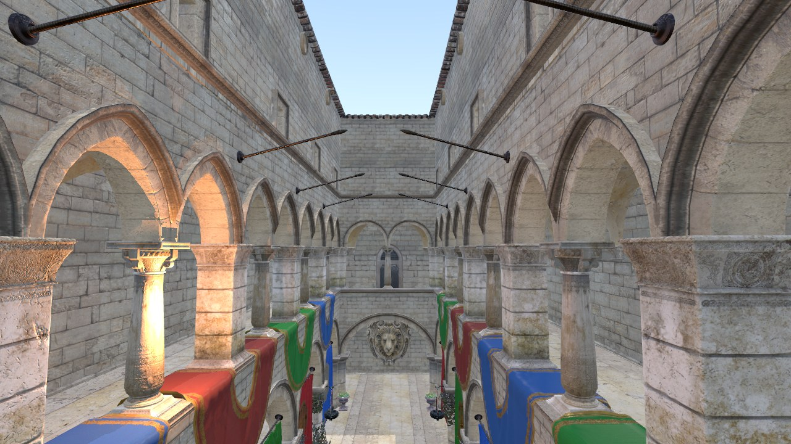
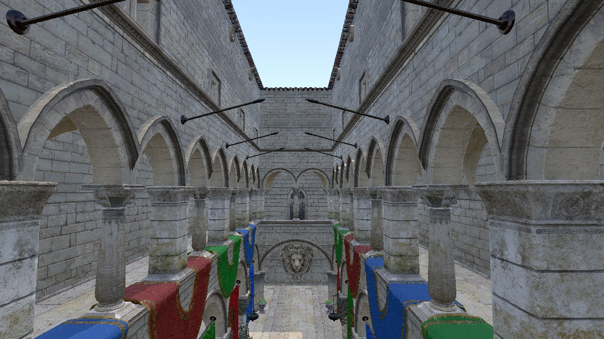
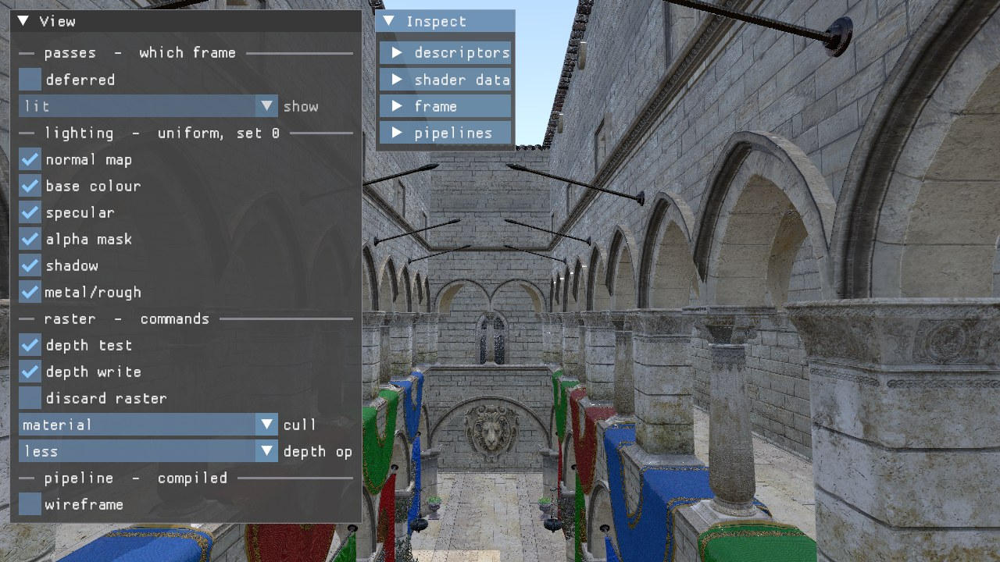

# RenderingEngine

A Vulkan 1.3 renderer. Forward and deferred paths that fill the same image, per-light
shadow maps, and an image-based lighting environment baked at startup.



| | |
|---|---|
| API | Vulkan 1.3, dynamic rendering (no `VkRenderPass`, no `VkFramebuffer`) |
| Scene | Sponza (glTF): 103 primitives, 192,496 vertices, 786,801 indices, 25 materials |
| Paths | forward (MSAA 4x) and deferred (G-buffer), switched at runtime |
| Lights | directional, spot and point; one shadow map per light that can have one |
| Environment | procedural sky cube, irradiance cube, prefiltered cube, BRDF LUT |
| Frames in flight | 2, with 3 swapchain images |
| Third party | volk, VMA, GLM, Dear ImGui, stb_image, cgltf, SPIRV-Reflect, GLFW |

Controls: `WASD` and `QE` to move, arrow keys to look.

## The frame

```
forward    shadow  sky  scene                 post  gui
deferred   shadow  sky  geometry  lighting    post  gui
```

Both paths write the same image. The forward path resolves its multisample colour into
it; the deferred path's lighting pass draws into it directly. Everything before and after
the middle is therefore one code path, and the difference between the two is four lines
in `RecordFrame`. Both are built at startup and hold their own descriptor sets, so the
switch rebuilds nothing.

| | forward | deferred |
|---|---|---|
| Samples | MSAA 4x | 1 |
| Shading | once per surface fragment | once per screen pixel, one fullscreen triangle |
| Intermediate storage | none | 4 G-buffer images (albedo, normal, metallic-roughness, depth) |

The G-buffer is single-sampled on purpose. Multisampling it would mean shading every
sample separately, because a normal averaged across an edge belongs to no surface. What
the two paths are meant to compare is structure, so the edges differ and that is correct.



*The same viewpoint, deferred. Only the edges differ, which is the MSAA difference.*

## Features

- **Shadows.** One 2048² depth map per light, as a layer of an array texture. Light `i`
  reads matrices `i` and samples layer `i`; nothing translates between the two indices.
- **Three light kinds.** `LightKind` decides what a light owns: a directional light has no
  position, the other two do. The struct the shader reads has no kind field, because a
  point light is a spot whose cone is open all the way, and `direction.w` being 0 or 1 is
  homogeneous coordinates rather than a flag.
- **Image-based lighting.** Four bakes at startup: sky cube (256², procedural), irradiance
  cube (32²), prefiltered cube (128², 5 mips), BRDF LUT (256² RG16F). Split-sum
  approximation. There is no environment texture file; the sky is a function of direction.
- **Direct lighting is Blinn-Phong**, not a microfacet BRDF. Roughness comes from the
  asset and drives the highlight width, and that is as far as it goes.
- **glTF loading** with tangent generation where the asset has none (one primitive in
  Sponza; the generator was checked against the 102 that ship tangents, mean dot 0.9953).
- MSAA resolve, resize and minimize handling, VMA for allocation.

## Design notes

### When each value is fixed

Vulkan forces this question for every value, and the answer decides where the value lives.

| Fixed at | Carried by | Examples |
|---|---|---|
| Pipeline creation | `VkGraphicsPipelineCreateInfo` | attachment formats, sample count, vertex layout, blend, polygon mode |
| Resource creation | descriptor set | camera, lights, shadow matrices, environment cubes, material |
| Per draw | push constants | model matrix, normal matrix, alpha (116 of 128 bytes) |
| Per command | `vkCmdSet*` | viewport, scissor, cull mode, depth test/write/compare |

The test is not how often a value changes but whether the driver has to compile something
different. Viewport and cull mode are registers, so making them dynamic is nearly free.
Blend, sample count and attachment formats change the compiled result, so they belong to
the pipeline. That is why the wireframe toggle costs a second pipeline and the depth test
toggle costs one command.

### Declare an intent, then validate it against independent facts

A value that is inferred cannot be checked, because the inference and the fact are the
same thing. So the upper layer declares what it means, and something that exists
independently says whether that is possible. Seven places have this shape:

| Declared by | Validated against |
|---|---|
| `MaterialSet()`, the composition of set 1 | shader reflection, types and names |
| `SharedBlocks()`, member offsets and sizes of five uniform blocks | shader reflection |
| `VertexInput()`, the vertex layout | shader reflection |
| `Attachment.role`, what this pass uses an image as | that image's format and usage |
| `Attachment.resolve`, what the pass leaves behind | the view handed to `BeginPass` |
| `AttachmentFormats`, what a pipeline was compiled for | what the pass declares |
| `ImageRequirement`, what a shader reads at a binding | the view written into that binding |

No offset is written by hand. `SharedBlocks()` is built from `offsetof` and `sizeof`, so
moving a field in the C++ struct moves the requirement with it, and a shader that did not
move is refused at startup. This fired twice on real changes: once on a member name when
the light uniform grew, once on a missing member when it shrank.

### Each layer validates with the facts it has

```
Pass declaration    resource, role, load/store, resolve        intent
       ^
       | validates
       |
Resource facts      format, usage, samples, extent, identity
       |
       | projection (identity is dropped here)
       v
Pipeline contract   colour/depth/stencil formats, samples
```

A pipeline never names a resource. Formats and sample counts reach it; which image does
not. Identity therefore cannot be checked through the projection and has to be asked on
both sides. The same split decides where a check belongs:
`ValidatePassDesc(const RenderPassDesc&)` takes no frame, so it cannot express a
frame-dependent check even by accident.

### What no check can reach

A `.spv` records the shader's view: numeric kind, component count, location, set, binding,
name. It does not record `VkFormat`, which belongs to the resource. A shader cannot tell
SRGB from UNORM, so reading a normal map as SRGB is silent under every check here. Those
places carry a `Contract:` comment instead, and there are four of them.

## Tools



The panel groups its switches by the path a value takes to the GPU: which passes run,
uniform contents, dynamic state commands, and the one switch that selects a different
compiled pipeline. The right-hand window reads back the descriptor pool, the reflected
shader interface and per-frame draw statistics.

- **GPU time per pass.** Timestamps written by the device, one query pool per frame in
  flight, read after that slot's fence. Both stamps are taken at `ALL_COMMANDS` so an
  interval covers one pass rather than the tail of the one before it, and a pass that did
  not run reads back as unavailable rather than as zero. On an RX 6800S at 1280x720 with
  three lights:

  | | shadow | sky | middle | post | total |
  |---|---|---|---|---|---|
  | forward | 2.807 | 0.344 | scene 3.431 | 0.057 | 6.639 ms |
  | deferred | 2.801 | 0.328 | geometry 2.569 + lighting 0.615 | 0.059 | 6.373 ms |

- **Frustum culling.** Six planes taken from `proj * view`, tested against each
  primitive's glTF bounds. It removes 34 of the 103 draws from this viewpoint and leaves
  both capture hashes byte-identical, which is what says nothing visible was dropped. The
  shadow pass keeps the full list, because geometry behind the camera still casts into
  the picture.
- **Image regression.** `LAMBDA_CAPTURE=<path>.bmp` writes the second frame's swapchain
  image and exits. Time is fixed under capture, so the same binary hashes the same twice.
  `Tools/capture.ps1` runs both paths and compares against `Tools/capture.baseline`.
- **Validation and synchronization layers** are kept at zero messages, checked with four
  resizes plus minimize and restore.
- **Draw statistics:** 69 draws of 103 items after frustum culling, 25 material binds,
  2 cull changes. Both bind counts are at their floor for this sort order.

## Build

Requires the Vulkan SDK (headers and `glslc`), CMake 3.24+, and a C++20 compiler.
GLFW is fetched during configure; everything else is vendored under `Source/ThirdParty/`.

```
cmake --preset default
cmake --build --preset default
```

On Windows run inside a `vcvars64.bat` environment, with the console code page set to
UTF-8 (`chcp 65001`). Under CP949 the output of `cl /showIncludes` does not match the
prefix ninja expects, header dependencies are recorded as none, and the build then keeps
linking stale objects after a header changes.

### Assets

The model is not in the repository. Take `Models/Sponza/glTF` from
[glTF-Sample-Assets](https://github.com/KhronosGroup/glTF-Sample-Assets) and put it in
`Assets/Sponza/`. Without it the program logs the reason and exits rather than drawing a
substitute.

## Layout

```
Source/Programs/sandbox/
  Vulkan/            API resources, one .h/.cpp pair per concept
                     Core, Instance, Device, Window, Swapchain, Commands, Frame,
                     Image, Attachments, Texture, Descriptors, Barrier, Timing,
                     Pipeline, Shader, Buffer, Mesh, VertexLayout
  Passes.h/.cpp      what the passes share, and the order of a frame
  ShadowPass         depth only, from where the light is
  ScenePass          forward, multisampled
  GeometryPass       deferred first half, four G-buffer images
  LightingPass       deferred second half, one fullscreen triangle
  PostProcessPass    the result of either middle onto the swapchain image
  Sky.h/.cpp         the four environment bakes and the pass that draws the sky
  Gui.h/.cpp         the panel (Dear ImGui)
  Gltf.h/.cpp        an asset file, as the arrays a frame is built from
  Bmp.h/.cpp         a captured frame, as a file
  Pipelines.h/.cpp   eleven shader programs, fourteen pipelines
  Renderer.h         everything that needs a VkDevice to exist
  main.cpp           window, input, frame loop
```

The dependency runs one way. `Passes.h` names types from `Vulkan/`, and no header under
`Vulkan/` knows what a pass is. `main` holds only what it takes to create a device;
everything that needs one is in `Renderer`.

Passes do not create the images they draw into. `main` creates them and hands the same
array to both sides, which is how the pass that draws a shadow map and the pass that reads
it refer to one image by one name.

## Not implemented

- Cube shadows for point lights.
- One mesh, no instancing.
- Compute and transfer queues are created but nothing is submitted to them.
- No deletion queue and no runtime shader reload.
- Pass dependencies are declared and their order is checked (`CheckPassOrder`), but the
  order itself is the sequence of calls in `RecordFrame` rather than data.

## Third party

See [THIRD_PARTY.md](THIRD_PARTY.md) for upstream, licenses, and what is actually
redistributed here.
